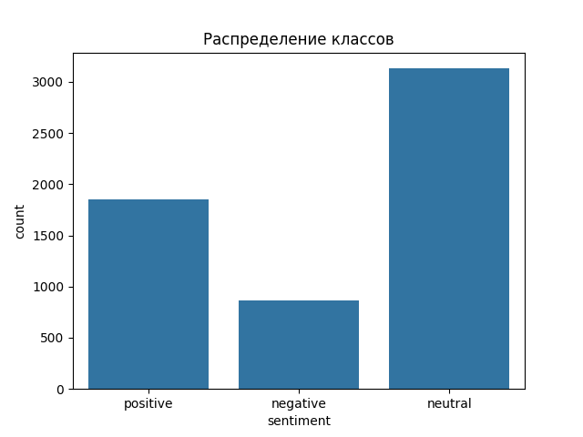
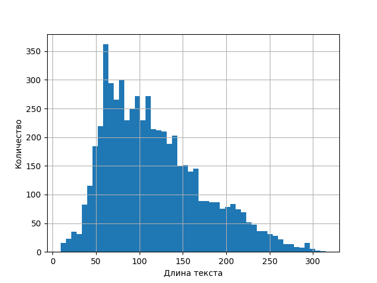
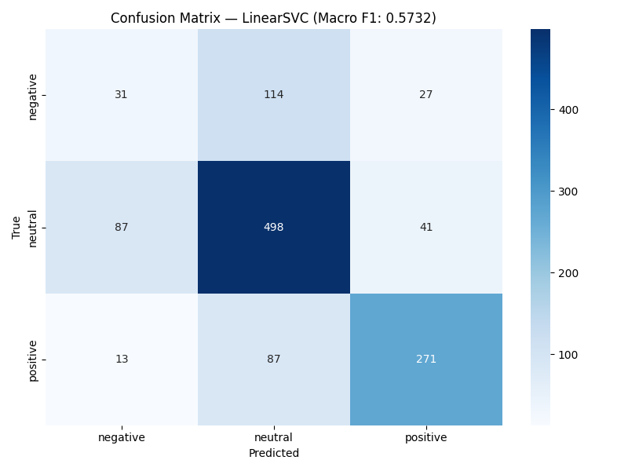

# Sentiment Analysis Classification

Классификация тональности финансовых новостей и твитов (3 класса: `positive` / `neutral` / `negative`) на датасете Financial PhraseBank + Twitter Financial.

## Задача

Сравнить классические подходы (TF-IDF + линейные модели) и понять, до какого потолка по `macro F1` они вытягивают на финансовых текстах. Базовая цель — получить рабочий бейзлайн и превзойти его минимум на +5%.

## Данные

- Файл: [`data.csv`](data.csv)
- Размер: 5 842 примера, 2 столбца — `Sentence`, `Sentiment`
- Распределение классов:

| Класс | Примеров |
|----------|----------|
| neutral  | 3 130 |
| positive | 1 852 |
| negative | 860 |

Данные несбалансированы — neutral-класс доминирует, что напрямую влияет на выбор `macro F1` как метрики.




## Подход

1. **Предобработка**: лемматизация через spaCy, удаление стоп-слов, очистка тикеров и спецсимволов.
2. **Векторизация**: TF-IDF с разными конфигурациями n-грамм и `sublinear_tf`.
3. **Модели**: Logistic Regression, LinearSVC, RandomForest, CatBoost.
4. **Оценка**: stratified train/test split, `macro F1`, classification report, confusion matrix, разбор ошибок.

## Результаты

| Метод | Macro F1 | Δ к baseline |
|-------|----------|--------------|
| Baseline TF-IDF(1,2) + LogReg | 0.5666 | — |
| TF-IDF(1,2) + LogReg, C=100 | 0.5604 | −0.62% |
| TF-IDF(1,3) + LinearSVC, C=1 | 0.5494 | −1.72% |
| TF-IDF(1,2) sublinear + LinearSVC, C=5 | 0.5710 | +0.44% |
| **TF-IDF(1,2) sublinear + LinearSVC, C=1** | **0.5732** | **+0.66%** |



Подробный разбор ошибок: [`error_analysis.txt`](error_analysis.txt) (369 ошибок из 1169, 31.6%).

## Выводы

Целевые +5% к бейзлайну в рамках TF-IDF + линейные классификаторы **не достигнуты** — потолок этого подхода на Financial PhraseBank ≈ 0.57–0.58 macro F1. Основные источники ошибок:

- сарказм и неявная негативная семантика в твитах (`"time to short"`, `"flashing oversold"`);
- смешанные сигналы в новостных формулировках (рост одного показателя на фоне падения другого);
- редкая лексика финансового домена, которой нет в bag-of-words.

Для пробития потолка нужны контекстные эмбеддинги — GloVe / BERT / FinBERT.

## Структура репозитория

```
.
├── notebook.ipynb              # исходный ноутбук с экспериментами
├── notebook_fixed.ipynb        # причёсанная финальная версия
├── data.csv                    # датасет
├── best_model.pkl              # сериализованная лучшая модель (LinearSVC)
├── vectorizer.pkl              # обученный TF-IDF векторизатор
├── baseline_result.txt         # macro F1 бейзлайна
├── results_table.txt           # сводная таблица экспериментов
├── error_analysis.txt          # разбор ошибочных предсказаний
├── confusion_matrix.png
├── sentiment_distribution.png
└── text_length_distribution.png
```

## Запуск

```bash
python -m venv venv
source venv/bin/activate
pip install pandas numpy scikit-learn catboost spacy seaborn matplotlib joblib jupyter
python -m spacy download en_core_web_sm

jupyter notebook notebook_fixed.ipynb
```

Использование уже обученной модели:

```python
import joblib

model = joblib.load("best_model.pkl")
vectorizer = joblib.load("vectorizer.pkl")

texts = ["Profit before taxes decreased 40% year-over-year"]
preds = model.predict(vectorizer.transform(texts))
print(preds)
```

## Стек

`scikit-learn` · `catboost` · `spaCy` · `pandas` · `numpy` · `matplotlib` · `seaborn` · `joblib`
